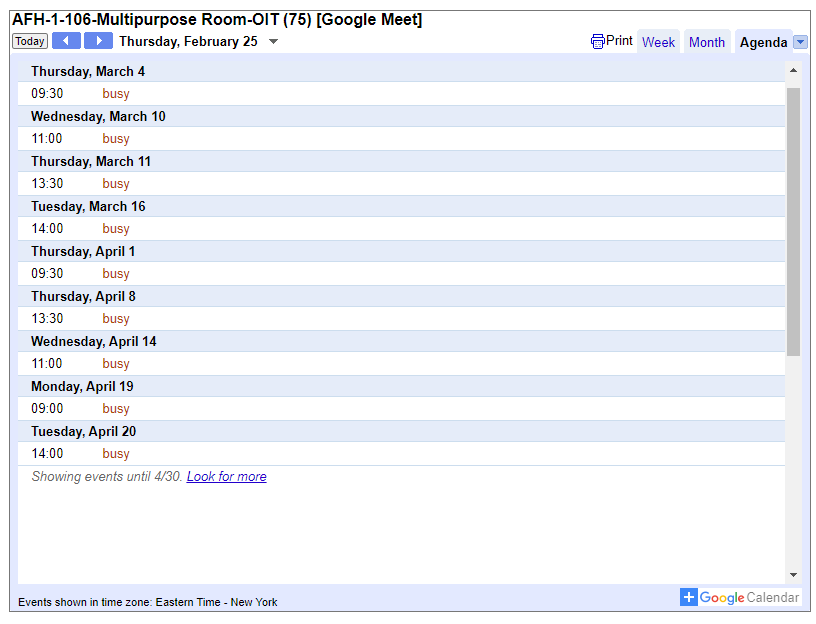
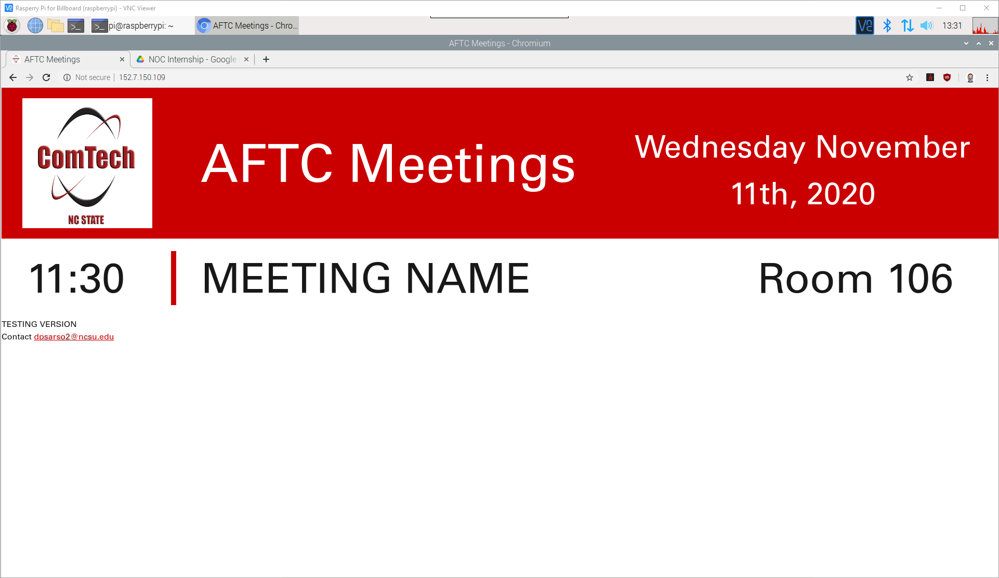

# PHP Project - Billboard Display for Google Calendar Room Calendars
## April 2020 - May 2020 (Roadblocked)
When I started my Network Operations internship, I was tasked by Trish to help display upcoming meetings on the billboards / TVs. The conference rooms could be reserved via Google Calendar. Thus, there were a multitude of resource calendars to check daily. 
The manager wanted to quickly check what meetings were happening, in what room, and at what time. Previous attempts used Google Calendar's iFrame method, selecting all resource calendars. 

The issue was that they showed irrelevant recurring events and was too small on TVs. iFrame wasn't responsive, so I decided to start from scratch.
# Task: Using a Raspberry Pi, serve the meetings onto all the buildings TVs to show today's upcoming meetings.
I decided to use PHP because I wanted some practice and that Google Calendar's Javascript API was a bit wonky for me. I also didn't want everyone to get my API keys to access my personal calendar events, so  server-side it twas. Finally, PHP was already approved + installed on the Raspberry Pis.
# Action
1. Review Google Calendar's PHP API.
2. Find all the room calendar's unique IDs
3. Once all calendars were found, only grab the **current** room events from 6:00-21:00 from each room.
4. Once all today's event were found, sort them with my custom function (that was fun to debug)
5. Once all sorted, output the events to HTML in index.php.
# Result

With Bootstrap, it was natively responsive. It looked great on the 1080p billboard tvs. It was quick to render. An issue I came across was that I did not have permission rights to *read the meeting titles* on certain room calendars. Make sense, you didn't want some intern to know about your special meeting. This lead to another problem: the code relied on my personal GCP keys. They're needed to be an impartial Google Account that didn't rely on incoming/outgoing interns GCP keys. Plus that impartial account could get access to the calendar since robots don't care about special meetings. Anyways that never got solved, but I hope it gets solved in the future.